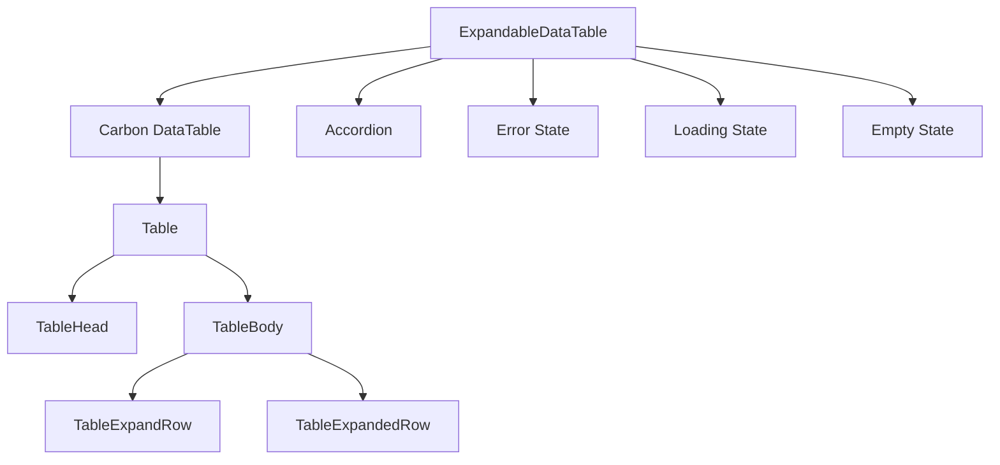

# ExpandableDataTable Component Guide

This guide provides comprehensive documentation for the ExpandableDataTable component implemented in the Bahmni Clinical Frontend application.

## Introduction

The ExpandableDataTable component is a reusable table component that displays data in a tabular format with expandable rows. It is built on top of Carbon Design System's DataTable component and provides additional features like:

- Loading state with skeleton
- Error state with formatted error message
- Empty state with customizable message
- Expandable rows with custom content
- Sorting functionality
- Accessibility support

The component is designed to be flexible and can be used to display various types of data in a consistent and user-friendly way.

## Architecture Overview

The ExpandableDataTable component is built using React and TypeScript, and it leverages Carbon Design System components for consistent styling and behavior.



### Component Structure

1. **ExpandableDataTable**: The main component that manages the rendering of different states.
2. **Accordion**: Wraps the table to provide a collapsible container with a title.
3. **DataTable**: Carbon component that provides the core table functionality.
4. **TableExpandRow/TableExpandedRow**: Carbon components that enable the expandable row functionality.

## Component API

The ExpandableDataTable component accepts a generic type parameter `T` which represents the type of data being displayed. This allows for type-safe usage with different data structures.

### Props

| Prop                  | Type                                          | Description                                                                           | Required |
| --------------------- | --------------------------------------------- | ------------------------------------------------------------------------------------- | -------- |
| tableTitle            | string                                        | Title for the table, displayed in the Accordion header                                | Yes      |
| rows                  | T[]                                           | Array of data to display in the table                                                 | Yes      |
| headers               | DataTableHeader[]                             | Column definitions for the table                                                      | Yes      |
| sortable              | { key: string; sortable: boolean }[]          | Array of objects specifying which columns are sortable by their key                   | No       |
| renderCell            | (row: T, cellId: string) => React.ReactNode   | Function to render the content of each cell                                           | Yes      |
| renderExpandedContent | (row: T) => React.ReactNode                   | Function to render the content of expanded rows                                       | Yes      |
| loading               | boolean                                       | Whether the table is in a loading state                                               | No       |
| error                 | unknown                                       | Error object to display in the error state                                            | No       |
| ariaLabel             | string                                        | Accessibility label for the table                                                     | No       |
| emptyStateMessage     | string                                        | Message to display when there are no rows                                             | No       |
| className             | string                                        | Custom CSS class for the component                                                    | No       |
| rowClassNames         | Record<string, string>                        | Object mapping row IDs to CSS class names to apply to specific rows                   | No       |

### Type Definitions

```typescript
interface ExpandableDataTableProps<T> {
  tableTitle: string;
  rows: T[];
  headers: DataTableHeader[];
  sortable?: { key: string; sortable: boolean }[];
  renderCell: (row: T, cellId: string) => React.ReactNode;
  renderExpandedContent: (row: T) => React.ReactNode;
  loading?: boolean;
  error?: unknown;
  ariaLabel?: string;
  emptyStateMessage?: string;
  className?: string;
  rowClassNames?: Record<string, string>;
}

// Carbon Design System type
interface DataTableHeader {
  key: string;
  header: string;
}
```

### Default Values

- `loading`: `false`
- `error`: `null`
- `sortable`: Defaults to all columns being sortable (`headers.map((header) => ({ key: header.key, sortable: true }))`)
- `ariaLabel`: Same as `tableTitle` if provided
- `emptyStateMessage`: `'No data available'`
- `className`: `'expandable-data-table-item'`
- `rowClassNames`: `{}`

## Row Expansion Behavior

The ExpandableDataTable component allows you to control which rows are expandable based on your data. This is done through the `renderExpandedContent` function.

### Expandable vs Non-Expandable Rows

- **Expandable Rows**: When `renderExpandedContent` returns valid JSX content for a row, that row will be rendered as an expandable row with an expand/collapse button.
- **Non-Expandable Rows**: When `renderExpandedContent` returns a falsy value (like `undefined`, `null`, or `false`) for a row, that row will be rendered as a regular row without an expand/collapse button.

This allows you to mix expandable and non-expandable rows in the same table based on your data requirements.

```tsx
const renderExpandedContent = (row: Item) => {
  // Only make rows with details expandable
  if (!row.details || row.details.length === 0) {
    return undefined; // This row will not be expandable
  }

  // Return content for expandable rows
  return (
    <div style={{ padding: '1rem' }}>
      <p>{row.details}</p>
    </div>
  );
};
```

### Implementation Details

Under the hood, the component uses different Carbon components based on whether a row is expandable:

- **Expandable Rows**: Uses `TableExpandRow` and `TableExpandedRow` from Carbon Design System
- **Non-Expandable Rows**: Uses regular `TableRow` from Carbon Design System

This approach ensures that non-expandable rows don't have unnecessary expand/collapse buttons, providing a cleaner user interface.

## Sorting Configuration

The ExpandableDataTable component provides built-in sorting functionality that can be configured using the `sortable` prop. This prop allows you to specify which columns should be sortable and which should not.

### Default Sorting Behavior

By default, all columns in the table are sortable. This means users can click on any column header to sort the table by that column in ascending or descending order.

```tsx
// All columns are sortable by default
<ExpandableDataTable
  tableTitle="Sample Table"
  rows={data}
  headers={headers}
  renderCell={renderCell}
  renderExpandedContent={renderExpandedContent}
/>
```

### Configuring Sortable Columns

You can customize which columns are sortable by providing a `sortable` array. This array should contain objects with `key` and `sortable` properties that specify which columns are sortable.

> **⚠️ Warning:** The `key` values in the `sortable` array must match exactly with the `key` values in the `headers` array. If a key doesn't match any header key, it will be ignored, which could lead to unexpected sorting behavior.

```tsx
const headers = [
  { key: "name", header: "Name" },
  { key: "status", header: "Status" },
  { key: "date", header: "Date" },
];

// Only the Name and Date columns will be sortable
const sortable = [
  { key: "name", sortable: true },
  { key: "status", sortable: false },
  { key: "date", sortable: true }
];

<ExpandableDataTable
  tableTitle="Sample Table"
  rows={data}
  headers={headers}
  sortable={sortable}
  renderCell={renderCell}
  renderExpandedContent={renderExpandedContent}
/>;
```

### Handling Edge Cases

The component handles various edge cases gracefully:

1. **Missing column keys**: If a column key in the `sortable` array doesn't match any header key, it will be ignored.

   ```tsx
   // Only the Name column will be sortable, nonexistent will be ignored
   const sortable = [
     { key: "name", sortable: true },
     { key: "nonexistent", sortable: true }
   ];
   ```

2. **Partial configuration**: If some columns are not specified in the `sortable` array, they will default to being sortable.

   ```tsx
   // Only Status is explicitly set to not be sortable, Name and Date will be sortable by default
   const sortable = [
     { key: "status", sortable: false }
   ];
   ```

3. **Empty sortable array**: If an empty array is provided, all columns will be sortable by default.

   ```tsx
   // All columns will be sortable
   const sortable = [];
   ```

## Row Styling Options

The ExpandableDataTable provides several ways to style rows based on your data:

### Row-Level Styling with rowClassNames

You can apply CSS classes to specific rows using the `rowClassNames` prop. This prop accepts an object where the keys are row IDs and the values are CSS class names.

```tsx
// Define row class names based on row IDs
const rowClassNames = {
  'row-1': 'criticalCell',
  'row-3': 'warningCell',
  'row-5': 'successCell'
};

// Use in component
<ExpandableDataTable
  // other props...
  rowClassNames={rowClassNames}
/>
```

### Dynamic Row Styling

You can dynamically generate the `rowClassNames` object based on your data:

```tsx
// Generate row class names dynamically
const rowClassNames = useMemo(() => {
  const classNames: Record<string, string> = {};
  
  rows.forEach(row => {
    if (row.id && row.status === 'Critical') {
      classNames[row.id] = 'criticalCell';
    } else if (row.id && row.status === 'Warning') {
      classNames[row.id] = 'warningCell';
    }
  });
  
  return classNames;
}, [rows]);
```

### Predefined CSS Classes

The component provides several predefined CSS classes for styling rows:

| Class Name   | Color Code | Use Case                                       |
| ------------ | ---------- | ---------------------------------------------- |
| criticalCell | #da1e28    | For highlighting critical or error values      |
| successCell  | #198038    | For highlighting successful or positive values |
| warningCell  | #f1c21b    | For highlighting warning states                |
| alertCell    | #ff832b    | For highlighting items needing attention       |

### Cell-Level Styling

You can also apply styling at the cell level using the `renderCell` function:

```tsx
const renderCell = (row: Item, cellId: string) => {
  switch (cellId) {
    case "status":
      return (
        <div className={row.status === "Critical" ? "criticalCell" : ""}>
          {row.status}
        </div>
      );
    case "value":
      if (row.value > threshold) {
        return <span className="alertCell">{row.value}</span>;
      }
      return row.value;
    // Other cases...
  }
};
```

You can combine these cell styles with Carbon Design System components:

```tsx
const renderCell = (row: Item, cellId: string) => {
  switch (cellId) {
    case "status":
      return (
        <Tag
          type={row.status === "Critical" ? "red" : "green"}
          className={row.status === "Critical" ? "criticalCell" : ""}
        >
          {row.status}
        </Tag>
      );
    // Other cases...
  }
};
```

## States and Rendering

The ExpandableDataTable component can render in different states based on the props provided:

### Normal State (With Data)

When valid data is provided in the `rows` prop, the component renders a table with the data and enables expandable rows.

```tsx
<ExpandableDataTable
  tableTitle="Sample Table"
  rows={data}
  headers={headers}
  renderCell={renderCell}
  renderExpandedContent={renderExpandedContent}
/>
```

### Loading State

When the `loading` prop is set to `true`, the component renders a skeleton loader to indicate that data is being loaded. The loading state is wrapped in an Accordion component for consistent styling.

```tsx
<ExpandableDataTable
  tableTitle="Sample Table"
  rows={[]}
  headers={headers}
  renderCell={renderCell}
  renderExpandedContent={renderExpandedContent}
  loading={true}
/>
```

### Error State

When the `error` prop is provided, the component renders an error message using the formatted error. The error state is wrapped in an Accordion component for consistent styling.

```tsx
<ExpandableDataTable
  tableTitle="Sample Table"
  rows={[]}
  headers={headers}
  renderCell={renderCell}
  renderExpandedContent={renderExpandedContent}
  error={new Error("Failed to fetch data")}
/>
```

### Empty State

When the `rows` prop is an empty array, the component renders an empty state message. The empty state is wrapped in an Accordion component for consistent styling.

```tsx
<ExpandableDataTable
  tableTitle="Sample Table"
  rows={[]}
  headers={headers}
  renderCell={renderCell}
  renderExpandedContent={renderExpandedContent}
  emptyStateMessage="No items available. Try adjusting your filters."
/>
```

## Usage Examples

### Basic Usage

```tsx
import React from "react";
import { ExpandableDataTable } from "@components/expandableDataTable/ExpandableDataTable";
import { DataTableHeader, Tag } from "@carbon/react";

// Define your data type
interface Item {
  id?: string;
  name: string;
  status: "Active" | "Inactive" | "Pending";
  date: string;
  details: string;
}

// Define your headers
const headers: DataTableHeader[] = [
  { key: "name", header: "Name" },
  { key: "status", header: "Status" },
  { key: "date", header: "Date" },
];

// Sample data
const items: Item[] = [
  {
    id: "1",
    name: "Item 1",
    status: "Active",
    date: "2025-03-15",
    details: "Detailed information for Item 1",
  },
  {
    id: "2",
    name: "Item 2",
    status: "Inactive",
    date: "2025-02-20",
    details: "Detailed information for Item 2",
  },
];

// Define cell renderer
const renderCell = (row: Item, cellId: string) => {
  switch (cellId) {
    case "name":
      return row.name;
    case "status":
      return (
        <Tag
          type={
            row.status === "Active"
              ? "green"
              : row.status === "Pending"
                ? "blue"
                : "gray"
          }
        >
          {row.status}
        </Tag>
      );
    case "date":
      return row.date;
    default:
      return null;
  }
};

// Define expanded content renderer
const renderExpandedContent = (row: Item) => (
  <div style={{ padding: "1rem" }}>
    <h4>Details for {row.name}</h4>
    <p>{row.details}</p>
  </div>
);

// Component usage
const MyComponent: React.FC = () => {
  return (
    <ExpandableDataTable
      tableTitle="Sample Table"
      rows={items}
      headers={headers}
      renderCell={renderCell}
      renderExpandedContent={renderExpandedContent}
    />
  );
};
```

### Example with Conditional Expansion and Row Styling

```tsx
import React, { useMemo } from "react";
import { ExpandableDataTable } from "@components/expandableDataTable/ExpandableDataTable";
import { DataTableHeader, Tag } from "@carbon/react";

// Define your data type
interface Item {
  id: string;
  name: string;
  status: "Active" | "Inactive" | "Critical";
  date: string;
  details?: string; // Optional details
}

// Sample data
const items: Item[] = [
  {
    id: "1",
    name: "Item 1",
    status: "Critical",
    date: "2025-03-15",
    details: "This item requires immediate attention",
  },
  {
    id: "2",
    name: "Item 2",
    status: "Active",
    date: "2025-02-20",
    // No details provided
  },
  {
    id: "3",
    name: "Item 3",
    status: "Inactive",
    date: "2025-01-10",
    details: "This item is no longer active",
  },
];

const MyConditionalTable: React.FC = () => {
  // Generate row class names based on status
  const rowClassNames = useMemo(() => {
    const classNames: Record<string, string> = {};
    
    items.forEach(item => {
      if (item.status === "Critical") {
        classNames[item.id] = "criticalCell";
      } else if (item.status === "Inactive") {
        classNames[item.id] = "warningCell";
      }
    });
    
    return classNames;
  }, [items]);
  
  // Define cell renderer
  const renderCell = (row: Item, cellId: string) => {
    switch (cellId) {
      case "name":
        return row.name;
      case "status":
        return (
          <Tag
            type={
              row.status === "Active"
                ? "green"
                : row.status === "Critical"
                  ? "red"
                  : "gray"
            }
          >
            {row.status}
          </Tag>
        );
      case "date":
        return row.date;
      default:
        return null;
    }
  };
  
  // Define conditional expanded content renderer
  const renderExpandedContent = (row: Item) => {
    // Only provide expanded content for rows with details
    if (!row.details) {
      return undefined; // This row will not be expandable
    }
    
    return (
      <div style={{ padding: "1rem" }}>
        <p>{row.details}</p>
      </div>
    );
  };
  
  return (
    <ExpandableDataTable
      tableTitle="Items with Conditional Expansion"
      rows={items}
      headers={[
        { key: "name", header: "Name" },
        { key: "status", header: "Status" },
        { key: "date", header: "Date" },
      ]}
      renderCell={renderCell}
      renderExpandedContent={renderExpandedContent}
      rowClassNames={rowClassNames}
    />
  );
};
```

### Example with Custom Sortable Configuration

```tsx
import React from "react";
import { ExpandableDataTable } from "@components/expandableDataTable/ExpandableDataTable";
import { DataTableHeader } from "@carbon/react";

// Define your data type
interface Item {
  id?: string;
  name: string;
  status: string;
  date: string;
  details: string;
}

// Define your headers
const headers: DataTableHeader[] = [
  { key: "name", header: "Name" },
  { key: "status", header: "Status" },
  { key: "date", header: "Date" },
];

// Define custom sortable configuration
const sortableConfig = [
  { key: "name", sortable: true },
  { key: "status", sortable: false }, // Status column is not sortable
  { key: "date", sortable: true },
];

// Component usage
const MySortableTable: React.FC = () => {
  return (
    <ExpandableDataTable
      tableTitle="Custom Sortable Table"
      rows={items}
      headers={headers}
      sortable={sortableConfig}
      renderCell={renderCell}
      renderExpandedContent={renderExpandedContent}
    />
  );
};
```

### Handling Loading State

```tsx
import React, { useState, useEffect } from "react";
import { ExpandableDataTable } from "@components/expandableDataTable/ExpandableDataTable";
import { fetchData } from "@services/api";

const DataTableWithLoading: React.FC = () => {
  const [data, setData] = useState<Item[]>([]);
  const [loading, setLoading] = useState<boolean>(true);
  const [error, setError] = useState<Error | null>(null);

  useEffect(() => {
    const loadData = async () => {
      try {
        setLoading(true);
        const result = await fetchData();
        setData(result);
        setError(null);
      } catch (err) {
        setError(err as Error);
      } finally {
        setLoading(false);
      }
    };

    loadData();
  }, []);

  return (
    <ExpandableDataTable
      tableTitle="Data Table"
      rows={data}
      headers={headers}
      renderCell={renderCell}
      renderExpandedContent={renderExpandedContent}
      loading={loading}
      error={error}
    />
  );
};
```

### Custom Cell Rendering with Rich Content

```tsx
const renderRichCell = (row: Item, cellId: string) => {
  switch (cellId) {
    case "name":
      return <strong>{row.name}</strong>;
    case "status":
      return (
        <Tag
          type={
            row.status === "Active"
              ? "green"
              : row.status === "Pending"
                ? "blue"
                : "gray"
          }
        >
          {row.status}
        </Tag>
      );
    case "date":
      // Format date in a more readable way
      const date = new Date(row.date);
      return date.toLocaleDateString("en-US", {
        year: "numeric",
        month: "short",
        day: "numeric",
      });
    default:
      return null;
  }
};
```

### Custom Expanded Content with Grid Layout

```tsx
const renderGridExpandedContent = (row: Item) => (
  <div style={{ padding: "1rem" }}>
    <h4>Details for {row.name}</h4>
    <div
      style={{
        display: "grid",
        gridTemplateColumns: "1fr 1fr",
        gap: "1rem",
      }}
    >
      <div>
        <h5>Basic Information</h5>
        <p>
          <strong>Status:</strong> {row.status}
        </p>
        <p>
          <strong>Date:</strong> {row.date}
        </p>
      </div>
      <div>
        <h5>Additional Information</h5>
        <p>
          <strong>Details:</strong> {row.details}
        </p>
      </div>
    </div>
  </div>
);
```

### Real-World Example: Patient Conditions

```tsx
interface Condition {
  id?: string;
  display: string;
  status: "Active" | "Inactive";
  onsetDate: string;
  recorder: string;
  recordedDate: string;
  code: string;
  codeDisplay: string;
}

const conditionHeaders: DataTableHeader[] = [
  { key: "display", header: "Condition" },
  { key: "status", header: "Status" },
  { key: "onsetDate", header: "Onset Date" },
  { key: "recorder", header: "Provider" },
  { key: "recordedDate", header: "Recorded Date" },
];

// Make only certain columns sortable
const conditionSortable = [
  { key: "display", sortable: true },
  { key: "status", sortable: false }, // Status column is not sortable
  { key: "onsetDate", sortable: true },
  { key: "recorder", sortable: true },
  { key: "recordedDate", sortable: true },
];

const renderConditionCell = (condition: Condition, cellId: string) => {
  switch (cellId) {
    case "display":
      return condition.display;
    case "status":
      return (
        <Tag type={condition.status === "Active" ? "green" : "gray"}>
          {condition.status}
        </Tag>
      );
    case "onsetDate":
      return condition.onsetDate
        ? new Date(condition.onsetDate).toLocaleDateString()
        : "N/A";
    case "recorder":
      return condition.recorder || "Not available";
    case "recordedDate":
      return condition.recordedDate
        ? new Date(condition.recordedDate).toLocaleString()
        : "N/A";
    default:
      return null;
  }
};

const renderConditionExpandedContent = (condition: Condition) => (
  <div style={{ padding: "1rem" }}>
    <p>
      <strong>Code:</strong> {condition.code || "Not available"}
    </p>
    <p>
      <strong>Code Display:</strong> {condition.codeDisplay || "Not available"}
    </p>
  </div>
);

// Usage
<ExpandableDataTable
  tableTitle="Patient Conditions"
  rows={conditions}
  headers={conditionHeaders}
  sortable={conditionSortable}
  renderCell={renderConditionCell}
  renderExpandedContent={renderConditionExpandedContent}
/>;
```

## Best Practices

### Performance Considerations

1. **Memoize render functions**: Use `React.useCallback` for `renderCell` and `renderExpandedContent` functions to prevent unnecessary re-renders.

```tsx
const renderCell = React.useCallback((row: Item, cellId: string) => {
  // Cell rendering logic
}, []);

const renderExpandedContent = React.useCallback((row: Item) => {
  // Expanded content rendering logic
}, []);
```

2. **Handle large datasets efficiently**: For tables with many rows, consider implementing pagination or virtualization.

3. **Optimize expanded content**: If expanded content is complex or contains heavy components, consider lazy loading or memoization.

### Accessibility Guidelines

1. **Provide meaningful `ariaLabel`**: Always provide a descriptive `ariaLabel` for the table.

2. **Use semantic markup in custom renderers**: Ensure that custom cell and expanded content renderers use proper semantic HTML.

3. **Keyboard navigation**: The component supports keyboard navigation through Carbon's DataTable, but ensure that any interactive elements in custom renderers are also keyboard accessible.

4. **Screen reader considerations**: Use ARIA attributes in custom renderers to improve screen reader experience.

```tsx
const renderAccessibleCell = (row: Item, cellId: string) => {
  switch (cellId) {
    case "status":
      return (
        <Tag
          type={row.status === "Active" ? "green" : "gray"}
          aria-label={`Status: ${row.status}`}
        >
          {row.status}
        </Tag>
      );
    // Other cases
  }
};
```

### Error Handling

1. **Provide informative error messages**: Use the `getFormattedError` utility to format errors consistently.

2. **Gracefully handle missing or incomplete data**: Ensure that `renderCell` and `renderExpandedContent` functions handle missing or undefined data gracefully.

```tsx
const renderRobustCell = (row: Item, cellId: string) => {
  switch (cellId) {
    case "name":
      return row.name || "N/A";
    case "status":
      return row.status ? (
        <Tag type={row.status === "Active" ? "green" : "gray"}>
          {row.status}
        </Tag>
      ) : (
        "N/A"
      );
    // Other cases
  }
};
```

### Data Formatting

1. **Format dates consistently**: Use consistent date formatting throughout the application.

2. **Handle empty or null values**: Provide fallbacks for empty or null values.

3. **Use appropriate visual indicators**: Use tags, icons, or other visual indicators to convey status or importance.

## Troubleshooting

### Common Issues

1. **Table not rendering as expected**:

   - Ensure that the `headers` array matches the properties accessed in the `renderCell` function.
   - Check that the `rows` array contains the expected data structure.

2. **Expanded content not displaying**:

   - Verify that the `renderExpandedContent` function is returning valid JSX.
   - Check for errors in the console that might indicate issues with the expanded content.

3. **Sorting not working correctly**:

   - Ensure that the data in the `rows` array is of the expected type for the column being sorted.
   - For custom sorting behavior, you may need to pre-process the data before passing it to the component.
   - Verify that the column keys in the `sortable` array match the keys in the `headers` array.

4. **Performance issues with large datasets**:
   - Consider implementing pagination or virtualization for large datasets.
   - Optimize the `renderCell` and `renderExpandedContent` functions to minimize unnecessary calculations.

### Solutions and Workarounds

1. **Handling rows without IDs**:

   - The component automatically generates IDs for rows that don't have an `id` property using the `generateId` utility.
   - If you need consistent IDs across renders, ensure that your data includes unique IDs.

2. **Customizing empty state**:

   - Use the `emptyStateMessage` prop to provide a custom message for the empty state.
   - For more complex empty states, you can modify the component to accept a custom empty state renderer.

3. **Handling complex data structures**:
   - For nested data structures, use dot notation or helper functions in your `renderCell` function to access nested properties.

```tsx
const renderNestedCell = (row: ComplexItem, cellId: string) => {
  switch (cellId) {
    case "user.name":
      return row.user?.name || "N/A";
    case "address.city":
      return row.address?.city || "N/A";
    // Other cases
  }
};
```

## API Reference

### ExpandableDataTable Component

```typescript
export const ExpandableDataTable = <T extends { id?: string }>({
  tableTitle,
  rows,
  headers,
  sortable = headers.map((header) => ({ key: header.key, sortable: true })),
  renderCell,
  renderExpandedContent,
  loading = false,
  error = null,
  ariaLabel = tableTitle,
  emptyStateMessage = "No data available",
  className = "expandable-data-table-item",
  rowClassNames = {},
}: ExpandableDataTableProps<T>) => {
  // Component implementation
};
```

### ExpandableDataTableProps Interface

```typescript
interface ExpandableDataTableProps<T> {
  tableTitle: string;
  rows: T[];
  headers: DataTableHeader[];
  sortable?: { key: string; sortable: boolean }[];
  renderCell: (row: T, cellId: string) => React.ReactNode;
  renderExpandedContent: (row: T) => React.ReactNode;
  loading?: boolean;
  error?: unknown;
  ariaLabel?: string;
  emptyStateMessage?: string;
  className?: string;
  rowClassNames?: Record<string, string>;
}
```

### Utility Functions

```typescript
// Generate a unique ID
const generateId = (): string => {
  // Implementation details
};

// Format error messages from different sources
const getFormattedError = (
  error: unknown,
): { title: string; message: string } => {
  // Implementation details
};
```

## Additional Resources

- [Carbon Design System - DataTable](https://carbondesignsystem.com/components/data-table/usage/)
- [Carbon Design System - Accordion](https://carbondesignsystem.com/components/accordion/usage/)
- [React Documentation](https://react.dev/)
- [TypeScript Documentation](https://www.typescriptlang.org/docs/)
