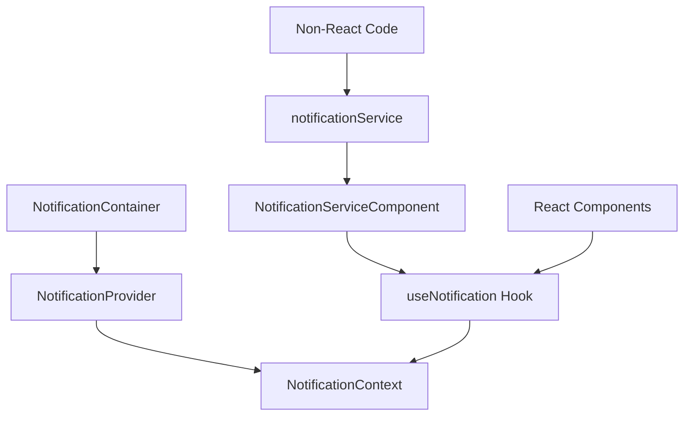

# Global Notification System Guide

This guide provides comprehensive documentation for the Global Notification system implemented in the Bahmni Clinical Frontend application.

## Introduction

The Global Notification system provides a centralized way to display notifications to users across the application. It supports different types of notifications (success, error, warning, info), automatic timeout dismissal, and can be used both within React components and in non-React code such as services or API interceptors.

The system is built using React Context API and follows best practices for performance and accessibility. It integrates with Carbon Design System's InlineNotification component for consistent styling.

## Architecture Overview

The notification system consists of several interconnected components:



### Components

1. **NotificationContext**: Defines the shape of the notification context and provides the interface for interacting with notifications.
2. **NotificationProvider**: Manages the state of notifications, including adding, removing, and automatically dismissing notifications after a timeout.
3. **useNotification**: A custom hook that provides access to the notification context within React components.
4. **notificationService**: A service that allows showing notifications from outside React components.
5. **NotificationServiceComponent**: A component that connects the notification service to the notification context.
6. **NotificationContainer**: A component that displays notifications using Carbon Design System's InlineNotification component.

## Using Notifications in React Components

Within React components, you can use the `useNotification` hook to access the notification context.

### Setup In React Components

First, ensure that your application is wrapped with the `NotificationProvider` component:

```tsx
// In your App.tsx or similar root component
import { NotificationProvider } from "@providers/NotificationProvider";
import { NotificationServiceComponent } from "@services/NotificationServiceComponent";

const App: React.FC = () => {
  return (
    <NotificationProvider>
      {/* Include the NotificationServiceComponent to enable the notification service */}
      <NotificationServiceComponent />
      {/* Your application components */}
      <YourComponent />
    </NotificationProvider>
  );
};
```

### Using the Hook

Then, in your components, you can use the `useNotification` hook:

```tsx
import { useNotification } from "@hooks/useNotification";

const YourComponent: React.FC = () => {
  const { addNotification, removeNotification, clearAllNotifications } =
    useNotification();

  const handleSuccess = () => {
    addNotification({
      title: "Success",
      message: "Operation completed successfully",
      type: "success",
      timeout: 5000, // Auto-dismiss after 5 seconds
    });
  };

  const handleError = () => {
    // Add a notification without a timeout (will remain until manually closed)
    const notificationId = addNotification({
      title: "Error",
      message: "Something went wrong",
      type: "error",
    });

    // You can use the returned ID to remove the notification later
    setTimeout(() => {
      removeNotification(notificationId);
    }, 10000);
  };

  const handleClearAll = () => {
    clearAllNotifications();
  };

  return (
    <div>
      <button onClick={handleSuccess}>Show Success</button>
      <button onClick={handleError}>Show Error</button>
      <button onClick={handleClearAll}>Clear All</button>
    </div>
  );
};
```

## Using Notifications Outside React Components

For non-React code such as services, API interceptors, or utility functions, you can use the `notificationService`.

### Setup Outside React Components

The `notificationService` is automatically set up when the `NotificationServiceComponent` is rendered within the `NotificationProvider`. Make sure you have included this component in your application as shown in the previous section.

### Using the Service

You can then import and use the `notificationService` in any file:

```ts
import { notificationService } from "@services/notificationService";

// In your service or API interceptor
export const fetchData = async () => {
  try {
    const response = await api.get("/data");
    notificationService.showSuccess(
      "Success",
      "Data fetched successfully",
      5000,
    );
    return response.data;
  } catch (error) {
    notificationService.showError("Error", "Failed to fetch data");
    throw error;
  }
};
```

## Notification Types and Attributes

The notification system supports four types of notifications:

1. **Success**: Used to indicate successful operations
2. **Error**: Used to indicate errors or failures
3. **Warning**: Used to indicate potential issues or warnings
4. **Info**: Used to provide general information

Each notification has the following attributes:

| Attribute | Type                                        | Description                                                                                                                                 | Required        |
| --------- | ------------------------------------------- | ------------------------------------------------------------------------------------------------------------------------------------------- | --------------- |
| id        | string                                      | Unique identifier for the notification (automatically generated)                                                                            | Yes (generated) |
| title     | string                                      | The title of the notification                                                                                                               | Yes             |
| message   | string                                      | The message content of the notification                                                                                                     | Yes             |
| type      | 'success' \| 'error' \| 'warning' \| 'info' | The type of notification                                                                                                                    | Yes             |
| timeout   | number \| undefined                         | Time in milliseconds after which the notification is automatically dismissed. If undefined, the notification remains until manually closed. | No              |

## Timeout Behavior

Notifications can be configured to automatically dismiss after a specified timeout:

- **With Timeout**: If a `timeout` value (in milliseconds) is provided, the notification will be automatically removed after that duration.
- **Without Timeout**: If no `timeout` is provided or it's set to `undefined`, the notification will remain visible until manually closed by the user or programmatically removed.

### Examples of Timeout Behavior

```tsx
// Auto-dismiss after 5 seconds
addNotification({
  title: "Success",
  message: "Operation completed successfully",
  type: "success",
  timeout: 5000,
});

// Remain until manually closed
addNotification({
  title: "Error",
  message: "Something went wrong",
  type: "error",
});
```

## Deduplication

The notification system automatically deduplicates notifications with the same title, message, and type:

- If a notification with the same title, message, and type already exists, it will not be added again.
- Instead, the existing notification's timeout will be updated with the new timeout value.

This prevents multiple identical notifications from being displayed, which can clutter the UI.

### Basic Usage in a React Component

```tsx
import React from "react";
import { useNotification } from "@hooks/useNotification";
import { Button } from "@carbon/react";

export const NotificationExample: React.FC = () => {
  const { addNotification } = useNotification();

  const handleClick = () => {
    addNotification({
      title: "Success",
      message: "Operation completed successfully",
      type: "success",
      timeout: 5000,
    });
  };

  return <Button onClick={handleClick}>Show Notification</Button>;
};
```

### Using with API Calls

```tsx
import React, { useState } from "react";
import { useNotification } from "@hooks/useNotification";
import { Button, Loading } from "@carbon/react";
import { api } from "@services/api";
import { getFormattedError } from "@utils/common";

export const DataFetchExample: React.FC = () => {
  const { addNotification } = useNotification();
  const [loading, setLoading] = useState(false);

  const fetchData = async () => {
    setLoading(true);
    try {
      const response = await api.get("/data");
      addNotification({
        title: "Success",
        message: "Data fetched successfully",
        type: "success",
        timeout: 5000,
      });
      return response.data;
    } catch (error) {
      const { title, message } = getFormattedError(error);
      addNotification({
        title: title,
        message: message,
        type: "error",
      });
    } finally {
      setLoading(false);
    }
  };

  return (
    <div>
      {loading && <Loading />}
      <Button onClick={fetchData} disabled={loading}>
        Fetch Data
      </Button>
    </div>
  );
};
```

### Using in a Service

```ts
// src/services/dataService.ts
import { api } from "@services/api";
import { notificationService } from "@services/notificationService";
import { getFormattedError } from "@utils/common";

export const dataService = {
  async fetchData() {
    try {
      const response = await api.get("/data");
      notificationService.showSuccess(
        "Success",
        "Data fetched successfully",
        5000,
      );
      return response.data;
    } catch (error) {
      const { title, message } = getFormattedError(error);
      notificationService.showError(title, message);
      throw error;
    }
  },

  async saveData(data: any) {
    try {
      const response = await api.post("/data", data);
      notificationService.showSuccess(
        "Success",
        "Data saved successfully",
        5000,
      );
      return response.data;
    } catch (error) {
      const { title, message } = getFormattedError(error);
      notificationService.showError(title, message);
      throw error;
    }
  },
};
```

## API Reference

### NotificationContext

```ts
interface NotificationContextType {
  notifications: Notification[];
  addNotification: (notification: Omit<Notification, "id">) => string;
  removeNotification: (id: string) => void;
  clearAllNotifications: () => void;
}
```

### Notification Type

```ts
interface Notification {
  id: string;
  title: string;
  message: string;
  type: "success" | "error" | "warning" | "info";
  timeout?: number; // in milliseconds, undefined means no auto-dismiss
}
```

### useNotification Hook

```ts
const useNotification = (): NotificationContextType => {
  // Returns the notification context
  // Throws an error if used outside of a NotificationProvider
};
```

### notificationService

```ts
interface NotificationServiceInterface {
  showSuccess: (title: string, message: string, timeout?: number) => void;
  showInfo: (title: string, message: string, timeout?: number) => void;
  showWarning: (title: string, message: string, timeout?: number) => void;
  showError: (title: string, message: string, timeout?: number) => void;
}
```

### Utility Functions

```ts
// Format error messages from different sources
const getFormattedError = (error: unknown): string => {
  // Returns a formatted error message
};
```

## Best Practices

1. **Use appropriate notification types**: Choose the correct type based on the nature of the message.
2. **Keep messages concise**: Use clear, concise language for both titles and messages.
3. **Set appropriate timeouts**: Use shorter timeouts for success messages and longer or no timeouts for error messages.
4. **Handle errors gracefully**: Use the `getFormattedError` utility to ensure consistent error formatting.
5. **Avoid notification overload**: Don't show too many notifications at once, as this can overwhelm users.
6. **Use the service for non-React code**: Always use the `notificationService` for notifications outside React components.
7. **Ensure the provider is set up**: Make sure the `NotificationProvider` and `NotificationServiceComponent` are properly included in your application.

## Troubleshooting

### Common Issues

1. **"useNotification must be used within a NotificationProvider" error**:

   - Ensure your component is wrapped with the `NotificationProvider`.
   - Check that the component tree structure is correct.

2. **"Notification service not properly initialized" error**:

   - Make sure the `NotificationServiceComponent` is included within the `NotificationProvider`.
   - Check that it's rendered before any code tries to use the notification service.

3. **Notifications not appearing**:

   - Verify that the `NotificationContainer` is being rendered.
   - Check that the notifications array in the context is being updated.
   - Ensure there are no CSS issues hiding the notifications.

4. **Notifications not auto-dismissing**:
   - Confirm that a valid timeout value (in milliseconds) is being provided.
   - Check for any code that might be clearing the timeout.

### Debugging

To debug notification issues, you can access the current notifications array from the context:

```tsx
const { notifications } = useNotification();
console.log("Current notifications:", notifications);
```

## Additional Resources

- [Carbon Design System - Notifications](https://carbondesignsystem.com/components/notification/usage/)
- [React Context API Documentation](https://react.dev/reference/react/createContext)
- [TypeScript Documentation](https://www.typescriptlang.org/docs/)
